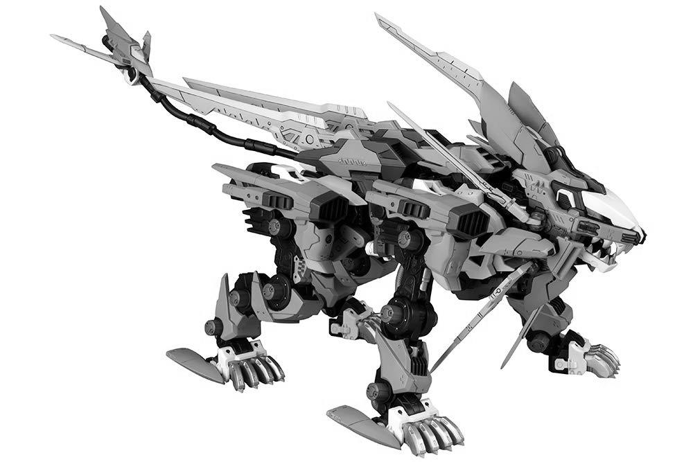

## Playing whit PIL / Pillow


#### PIL (Python Image Library)

#### [Pillow (Python Image Library (Fork) )](https://pypi.org/project/Pillow/)

> #### *PIL is support unique Python 2.7*
> #### *Pillow is one bifurcation support for Python 3.x*

### Requirement

```shell
pip install Pillow
```

### Execute

- Run first example

```shell
python 01_basic.py
```

- Run second example

```shell
python 02_basic.py
```

### Example

- Original
  

- Convert (Gray)
  

- Rotate
  

- Resize
  


